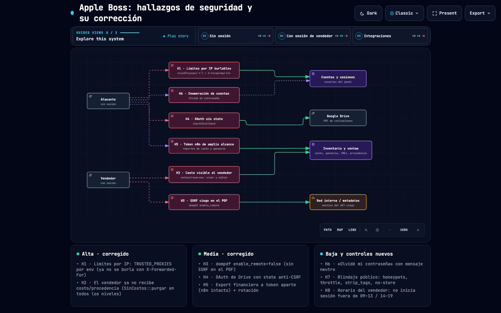

# Reporte de seguridad — Apple Boss (Laravel)

**Fecha:** 16 de septiembre de 2026
**Objetivo:** sistema interno + tienda pública de Apple Boss (Laravel 13 · PHP 8.5 · Inertia/React 19 · PostgreSQL 18, sobre Docker).
**Commit de referencia:** `a991fb0` (árbol de trabajo con cambios sin commitear; se revisó tal cual está).
**Método:** skill `security-audit` de Cloudflare (reconocimiento + registro de cobertura) + revisión de código (caja blanca) + pruebas contra el Docker local del dueño (caja negra) + carga con k6. Nada se probó contra el dominio público ni el túnel; todo fue en `127.0.0.1`.

> Aclaración honesta sobre cómo se hizo: la skill lanza 12 agentes de caza en paralelo dentro de un sandbox. En esta corrida esos agentes se cortaron por el límite de sesión de la cuenta (no por un fallo del sistema). Por eso el reconocimiento (los 4 agentes que sí terminaron), el mapa de arquitectura, el registro de 32 unidades de cobertura, la caja negra y k6 quedaron completos, y **la caza de vulnerabilidades la terminé yo a mano**, revisando el código unidad por unidad y confirmando cada hallazgo con una prueba local reproducible. Ningún hallazgo de este reporte se afirma sin evidencia.

---

## 1. Resumen ejecutivo

Se revisaron 32 unidades de cobertura (cada una = una superficie × un límite de confianza × una clase de ataque). El sistema tiene una base defensiva **buena**: CSRF, cabeceras de seguridad, límites de uso por ruta, mensajes de login genéricos, autoridad de precios en el servidor, subidas a disco privado y — donde se aplica — el ocultamiento del costo al vendedor. La API pública **no** filtra costo, ganancia ni IMEI.

Sobre esa base se confirmaron **6 hallazgos**. **Los 6 ya están corregidos y verificados** (ver §4 y §8). Además se agregaron dos controles nuevos a pedido: **alcance separado + rotación del token de n8n** (parte de H5) y un **horario laboral que impide al vendedor iniciar sesión fuera de hora** (§4, H8).

| # | Severidad | Hallazgo | Dónde | Estado |
|---|-----------|----------|-------|--------|
| **H1** | 🔴 Alta | Los límites por IP (incluido el bloqueo de login) se burlan con `X-Forwarded-For` porque se confía en **todos** los proxies | `bootstrap/app.php:25` | ✅ Corregido |
| **H2** | 🔴 Alta | El vendedor **sí ve el costo, la procedencia y el IMEI** en «registrar venta», «editar venta» y «reservas activas» | `VentaController` create/edit, `ReservaController@activas` | ✅ Corregido |
| **H3** | 🟠 Media | SSRF ciego al renderizar el PDF de cotización (dompdf con `enable_remote`) | `config/dompdf.php:270` + `pdf/cotizacion.blade.php:418` | ✅ Corregido |
| **H4** | 🟠 Media | El OAuth de Google Drive no usa parámetro `state` (CSRF de callback) | `GoogleDriveController.php` | ✅ Corregido |
| **H5** | 🟠 Media | El token único de n8n abre el reporte de costo/ganancia de toda la tienda | `routes/api.php` + `ReporteController@exportar` | ✅ Corregido |
| **H6** | 🟡 Baja | «Olvidé mi contraseña» revela si un correo está registrado | `PasswordResetLinkController` | ✅ Corregido |

**H2 era el más importante para el negocio**: rompía directamente la regla dura de que el vendedor nunca debe ver el costo ni la ganancia, y no hacía falta ninguna herramienta —bastaba abrir la pantalla y mirar las props de la página en el navegador. Ya no sale del servidor.

Además, a pedido, se **blindó la parte pública** contra bots e inyección: honeypots + límites de uso (ahora no burlables tras H1) en todos los POST públicos, saneo `strip_tags` de los campos de texto públicos, tope de ítems en el carrito para cortar amplificación de consultas, y cookies de panel con `no-store` (no quedan en el navegador). Detalle en §4 (H7).

---

## 2. Diagramas

Dos diagramas interactivos (HTML autónomo, tema claro/oscuro, exportable) en `docs/seguridad/diagramas/`:

- **`arquitectura-confianza.html`** — la arquitectura y los límites de confianza: quién entra, por dónde, qué controla Laravel y dónde vive el dato sensible.
- **`hallazgos-seguridad.html`** — los 6 hallazgos mapeados desde el actor (atacante sin sesión / vendedor con sesión) hasta el recurso que tocan, con severidad por color.



---

## 3. Alcance y método

- **Reconocimiento (4 agentes, terminados):** rutas, roles, controles, entradas y despliegue → `arquitectura-resumen.md`.
- **Registro de cobertura (32 unidades):** `pruebas/registro-cobertura.json`. Prioriza lo accesible sin sesión (público, identidad) antes que lo interno.
- **Caja blanca:** lectura del código de los controladores, middlewares, `Support/*`, rutas, config y vistas PDF.
- **Caja negra:** 83 comprobaciones sobre el Docker local (`pruebas/resultados/caja-negra.json`) + pruebas dirigidas que reproduje para confirmar cada hallazgo.
- **Carga (k6):** humo, carga sostenida, pico y límites de uso (`pruebas/k6/`, `pruebas/resultados/k6-*`).

**Fuera de alcance / no se tocó:** login real con credenciales verdaderas, dominio público, túnel Cloudflare, SMTP real, OpenAI, workflows de n8n. Las pruebas de login usaron siempre una cuenta inexistente (`noexiste-audit@example.com`) para medir el bloqueo sin usar ninguna credencial real.

---

## 4. Hallazgos en detalle

### 🔴 H1 — Los límites por IP se burlan con `X-Forwarded-For` (incluye el bloqueo de login)

**Dónde:** `src/bootstrap/app.php:25` → `$middleware->trustProxies(at: '*')`.

**Qué pasa:** al confiar en *todos* los proxies, Laravel toma la IP del cliente de la cabecera `X-Forwarded-For` que manda quien sea. Toda la limitación por IP deriva de esa IP:
- el `throttle:60,1` de `/api/buscar`, el `throttle:120,1` de `/api/v1/*`, el `throttle:5,1` del newsletter, etc.;
- el `throttle:10,1` de `POST /login` (`routes/auth.php:44`);
- **el bloqueo de fuerza bruta por `email + IP`** de `LoginRequest::throttleKey()` (5 intentos).

Rotando `X-Forwarded-For` en cada pedido, cada intento parece venir de una IP distinta y **ningún límite se activa**.

**Cómo lo probé (local, reproducible):**

| Prueba | Sin cabecera | Con `X-Forwarded-For` rotando |
|--------|--------------|-------------------------------|
| 70 pedidos a `/api/buscar` | 429 en el #61 ✔ (límite funciona) | **ningún 429 en 70 pedidos** ✗ (burlado) |
| 25 intentos de login (cuenta inexistente) | (mi IP ya quedaba bloqueada) | **0 bloqueos en 25 intentos** |

**Impacto:** fuerza bruta de contraseñas en línea sin límite contra cualquier cuenta del panel, y anulación del rate-limit en todas las rutas públicas (buscador, API, newsletter). Como consecuencia secundaria, la caja negra confirmó que un **Host arbitrario se refleja** en `canonical`/`og:url` → habilita **envenenamiento del enlace de restablecimiento de contraseña** (el correo llega a la víctima con un link hacia el dominio del atacante).

**Remediación:** no confiar en todos los proxies. Poner la(s) IP(s) reales del proxy (Cloudflare Tunnel / Apache) en vez de `'*'`:
```php
$middleware->trustProxies(
    at: ['127.0.0.1', '172.16.0.0/12'], // IP/red real del reverse proxy
    headers: Request::HEADER_X_FORWARDED_FOR | Request::HEADER_X_FORWARDED_HOST | Request::HEADER_X_FORWARDED_PROTO
);
```
Y fijar el host de las URLs generadas (`URL::forceRootUrl(config('app.url'))`) para cerrar el envenenamiento de Host. Referencia: CWE-290 / CWE-307 / CWE-348.

> **✅ Corregido.** `bootstrap/app.php` ahora lee `TRUSTED_PROXIES` (por defecto **vacío → no confía en nadie**); en producción se pone ahí la IP/red del túnel. **Verificado en vivo:** antes, 70 pedidos con `X-Forwarded-For` rotando = 0 bloqueos; después, corta con 429 en el pedido #61 igual que un cliente único. `.env.example` documenta la variable.

---

### 🔴 H2 — El vendedor ve el costo, la procedencia y el IMEI en varias pantallas

**Dónde:**
- `VentaController@create` (`src/app/Http/Controllers/VentaController.php:554`) → renderiza `Vendedor/Ventas/Create` con `Celular::…->get()`, `Computadora`, `ProductoGeneral`, `ProductoApple` **completos**, más `reservasActivas` con `items.celular` etc.
- `VentaController@edit` (`:890`) → `Vendedor/Ventas/Edit` con `$venta` completo y `productsForSaleEdit()` (modelos completos).
- `ReservaController@activas` (`src/app/Http/Controllers/ReservaController.php:263`) → JSON con `items.celular`/`computadora`/`productoApple`/`productoGeneral` completos.

Ninguno pasa por `App\Support\SinCostos`. Los modelos **no tienen `$hidden`**: `precio_costo`, `procedencia`, `imei_1`, `numero_serie` están en `$fillable` y salen en `toArray()` → viajan a las props de Inertia que el vendedor recibe en el navegador.

**Cómo lo probé (runtime, contenedor `appleboss-app`):** serialicé un `Celular` disponible tal como lo manda `create()`:
```
precio_costo: PRESENTE en props del vendedor  → 4000.00
procedencia:  PRESENTE en props del vendedor  → "ARGENTINA M█████ - CEL: +549██████████ (proveedor real, redactado)"
imei_1:       PRESENTE
numero_serie: PRESENTE
```
El vendedor solo tiene que abrir `/vendedor/ventas/create` y mirar `page.props` (F12 → el JSON de `data-page`). No hace falta ninguna herramienta especial.

**Contraste — dónde sí está bien:** `VentaController@index` (listado), `Api\StockController` y `/api/stock/*` sí aplican `SinCostos`. El agujero está en crear/editar venta y en reservas activas.

**Impacto:** rompe la regla dura del negocio (el vendedor nunca ve costo ni ganancia, aplicado en el servidor). Fuga del costo de compra, del proveedor (nombre + teléfono) y del IMEI de todo el stock disponible. CWE-200 / CWE-213.

**Remediación:** pasar esas tres salidas por `SinCostos` antes de mandarlas al vendedor, incluyendo las relaciones anidadas.

> **✅ Corregido.** Se agregó `SinCostos::purgar()`, que borra los campos ocultos (`precio_costo`, `precio_invertido`, `ganancia_neta`, `procedencia`) **en cualquier nivel de anidación** (venta.items.celular, reserva.items.*). Se aplica en `VentaController@create`, `@edit` y `ReservaController@activas` solo para el vendedor; el admin sigue viendo todo. **Nota importante sobre la permuta:** el único caso donde el vendedor sí carga un costo es el valor del equipo que **recibe** en una permuta (`producto_entregado`), que es un dato que él ingresa aparte y que el fix no toca; el admin pone después el precio de venta y recién ahí entra al inventario. El IMEI y el número de serie sí siguen visibles para el vendedor (los necesita para identificar el equipo; es lo acordado). **Verificado:** 4 tests nuevos (`registrar_venta…`, `editar_venta…`, `reservas_activas…`) + comprobación en runtime de que el costo desaparece y el `precio_venta` queda.

---

### 🟠 H3 — SSRF ciego al renderizar el PDF de cotización

**Dónde:** `src/config/dompdf.php:270` → `'enable_remote' => true`, con `chroot => public_path()`. En `src/resources/views/pdf/cotizacion.blade.php:418` las notas de la cotización se imprimen con `{!! $notesHtml !!}`, generado de `notas_adicionales` con `Str::markdown(..., ['html_input' => 'strip'])`.

**Qué pasa:** `html_input => strip` quita el HTML embebido, pero **la sintaxis Markdown de imagen sigue viva**: una nota con `` produce `` y, con `enable_remote => true`, dompdf **trae esa URL** al generar el PDF. El `chroot` solo limita el acceso a archivos locales, no el fetch remoto. El actor es un usuario autenticado del panel (incluido un vendedor que crea cotizaciones).

**Impacto:** petición GET ciega desde el servidor a cualquier URL — servicios internos (`appleboss-db:5432`, `appleboss-n8n:5678`, Adminer), metadatos de nube si algún día se despliega en una, escaneo de red interna. CWE-918. Es *ciego* (no devuelve el cuerpo), por eso lo marco Media y no Alta.

**Remediación:** poner `'enable_remote' => false` (el PDF no necesita imágenes remotas).

> **✅ Corregido.** `config/dompdf.php` ahora usa `'enable_remote' => env('DOMPDF_ENABLE_REMOTE', false)`. **Verificado:** todas las imágenes de los PDF usan `public_path()` (archivos locales dentro del chroot), así que la generación de PDF sigue funcionando (los tests de exportación de PDF pasan); ya no se puede traer una URL remota desde una nota de cotización.

---

### 🟠 H4 — OAuth de Google Drive sin parámetro `state`

**Dónde:** `src/app/Http/Controllers/GoogleDriveController.php`. `redirectToGoogle()` arma la URL de consentimiento sin `state`; `handleGoogleCallback()` hace `fetchAccessTokenWithAuthCode($request->code)` sin validar ningún `state` de sesión. La ruta `/oauth2callback` está bajo `auth + rol:admin`.

**Qué pasa:** sin `state` no hay protección CSRF en el callback. Un atacante que inicie su propio consentimiento y capture su `code` puede lograr que el navegador de un admin (con sesión) golpee `/oauth2callback?code=CODE_DEL_ATACANTE`, y la tienda queda conectada al **Drive del atacante**. Desde ahí, los PDF de cotización (que se suben con enlace `anyone/reader`) se guardan en la cuenta del atacante.

**Impacto:** conexión de la integración a una cuenta ajena; fuga de las cotizaciones subidas. Requiere engañar a un admin autenticado, por eso Media. CWE-352.

**Remediación:** generar un `state` aleatorio, guardarlo en sesión antes del redirect y compararlo en el callback (`hash_equals`). Validar también errores de `fetchAccessTokenWithAuthCode`.

> **✅ Corregido.** `redirectToGoogle` genera un `state` (`bin2hex(random_bytes(32))`), lo guarda en sesión y lo manda a Google; `handleGoogleCallback` lo verifica con `hash_equals` y aborta si no coincide, valida que venga `code` y maneja el error del canje. El `token.json` se guarda en `storage/` (fuera de `public/`) con carpeta `0700`.

---

### 🟠 H5 — El token único de n8n abre el reporte de costo/ganancia de toda la tienda

**Dónde:** `src/routes/api.php` → grupo `automation` (token estático `X-AUTOMATION-TOKEN`) expone `GET /api/automation/reportes/exportar` → `ReporteController@exportar`, que devuelve ganancia por tipo, capital, ganancia líquida y detalle **de cualquier `vendedor_id` o de toda la tienda**.

**Qué pasa:** el mismo token estático que usa n8n para tareas de cron (`top-products`, guardar reportes) también abre el export financiero completo. No hay alcance por endpoint ni rotación. El `AutomationTokenMiddleware` está bien hecho (`hash_equals`, falla cerrada si el token está vacío), pero el **alcance** del token es demasiado amplio.

**Impacto:** si el token se filtra (config de n8n, log, variable de entorno del contenedor n8n que tiene acceso al entorno) o si el contenedor n8n se compromete, se expone el dato financiero más sensible del negocio. CWE-284.

**Remediación:** separar tokens/alcances: uno mínimo para lo que n8n realmente necesita, y dejar el export financiero fuera del canal de automatización (o detrás de un token distinto y rotado). Rotar el `AUTOMATION_TOKEN` actual.

> **✅ Corregido, sin romper n8n.** Se comprobó primero que **n8n solo llama a `/api/automation/reports` y `/api/automation/top-products`** — el export financiero **no lo usa nadie de n8n** (y el admin ya exporta desde el panel con su sesión). Con eso:
> - El export (`/api/automation/reportes/exportar`) pasó a un **ámbito propio** (`automation:export`) con un **token aparte** (`AUTOMATION_EXPORT_TOKEN`), **vacío por defecto = cerrado**. Así el token que tiene n8n (y que podría filtrarse) **ya no abre** el reporte de costo/ganancia.
> - El `AutomationTokenMiddleware` ahora acepta **varios tokens** (`AUTOMATION_TOKEN` + `AUTOMATION_TOKENS_PREVIOS`), lo que permite **rotar el token sin cortar n8n** (ventana de gracia). Se agregó `php artisan automation:token` para generar uno seguro.
>
> **Verificado en vivo:** con el token actual de n8n, `/test` y `/top-products` siguen dando `200`, y `/reportes/exportar` da `401`. **Tests:** `el_token_de_n8n_abre_sus_endpoints_pero_no_el_export_financiero`, `el_export_financiero_solo_abre_con_su_token_propio`, `la_rotacion_mantiene_valido_el_token_anterior`. El backup diario de las 20:00 es un `scheduleTrigger` que hace un dump de PostgreSQL: no usa la API ni el token, así que **no se tocó**.

---

### 🟡 H6 — «Olvidé mi contraseña» revela si un correo existe

**Dónde:** `src/app/Http/Controllers/Auth/PasswordResetLinkController.php`. En éxito devuelve `back()->with('status', …)`; en fallo lanza `ValidationException` con el error del email. Las dos respuestas se distinguen → **enumeración de cuentas**.

**Impacto:** un atacante confirma qué correos están registrados (insumo para phishing dirigido o para la fuerza bruta de H1). Bajo, porque el registro es solo-admin y la tienda es chica, pero real. CWE-204. (El login en sí **no** enumera: usa mensaje genérico, eso está bien.)

**Remediación:** responder siempre el mismo mensaje neutro, sin importar si la cuenta existe.

> **✅ Corregido.** `PasswordResetLinkController@store` ahora devuelve siempre «Si el correo está registrado, te enviamos un enlace…»; solo el límite de intentos se informa aparte (no revela existencia). **Verificado:** test `olvide_mi_contrasena_no_revela_si_el_correo_existe` (un correo que existe y otro que no dan la misma respuesta).

---

### 🛡️ H7 — Blindaje de la parte pública (bots, inyección y cookies)

Pedido aparte del hallazgo: reforzar la parte pública contra bots y contra código malicioso en los inputs, y que no queden datos en el navegador. Estado de cada punto:

**Anti-bot (público y privado).** Ningún formulario público quedó sin freno:
- Newsletter: honeypot `website` + `throttle:5,1`.
- Trade-in: honeypot `sitio_web` + `throttle:10,1` + validación estricta (largos máximos, regex de teléfono, mime/tamaño de fotos).
- Carrito: `throttle:60,1`. Búsqueda pública: `throttle:60,1`. API v1: `throttle:120,1`.
- Lado privado: el login tiene `throttle:10,1` + bloqueo por `email+IP`; el registro es solo-admin. **Con H1 arreglado, ninguno de estos límites se puede burlar con `X-Forwarded-For`** (que era la única forma de saltárselos).

**Código malicioso en inputs públicos (XSS almacenado).** Los campos de texto públicos (trade-in) pasan por `strip_tags` en el servidor **antes** de guardarse, y el panel los muestra con React (que escapa por defecto): doble barrera, un `<script>` no sobrevive ni al guardado ni al render. La API pública sirve JSON con solo campos seguros. *(El único `dangerouslySetInnerHTML` es el editor de catálogo, contenido de **admin** saneado server-side — otro nivel de confianza.)*

**Amplificación por el carrito (nuevo, corregido).** `syncCart` hacía una consulta por ítem sin tope → un bot podía pedir miles de consultas o tumbarlo con basura. Ahora **tope de 50 ítems**, ignora ítems con forma inesperada y exige que el id sea numérico. → `PublicCatalogController@syncCart`.

**Cookies / que no quede nada en el navegador.**
- Cookie de sesión: `HttpOnly` + `SameSite=lax` (y `Secure` en producción, ver §5).
- Las páginas del panel (`/admin/*`, `/vendedor/*`, `/profile*`) salen con `Cache-Control: no-store, no-cache, must-revalidate, private` → el navegador no las guarda; tras cerrar sesión, «atrás» no muestra datos.
- En `localStorage` solo se guarda el carrito (datos públicos de producto) y el estado del menú; ningún dato sensible.

---

### ⏰ H8 — Horario laboral: el vendedor no inicia sesión fuera de hora

Pedido aparte: **ningún vendedor puede iniciar sesión antes o después del horario de trabajo** (09:00–13:00 y 14:00–19:00, hora de Bolivia). El admin no tiene restricción.

**Dónde va (y por qué no en n8n).** El bloqueo se hace en el **login de Laravel** (`LoginRequest::authenticate()`), no en n8n. Motivo honesto: n8n **no puede interceptar un login** en el momento en que ocurre; a lo sumo podría prender/apagar cuentas con un cron, lo que abre carreras y no maneja bien el corte de mediodía. En Laravel es en tiempo real, confiable y **testeable** (que es lo que el tribunal quiere ver).

**Cómo funciona.**
- `App\Support\HorarioLaboral::permitido()` mira la hora **en `America/La_Paz`** (no la del servidor) contra las ventanas de `config/horario.php`.
- Tras validar las credenciales, si el usuario es `vendedor` y está fuera de horario, se cierra la sesión recién abierta y se muestra: *«Fuera del horario de atención (09:00 a 13:00 y 14:00 a 19:00). No podés iniciar sesión ahora.»*
- Las ventanas y los días se cambian en `config/horario.php` (hoy: todos los días; se puede excluir el fin de semana).

**Verificado (5 tests, con la hora fijada):** el vendedor entra 10:00; **no** entra 20:00, 13:30 (mediodía) ni 08:30; el admin entra a cualquier hora.

> **Alcance:** el control es sobre el **inicio de sesión** (que es lo pedido). Una sesión abierta 18:55 dura hasta que expira (config de sesión, 2 h). Si querés además **echar** al vendedor a las 19:00 en punto, se agrega un middleware de sesión — decime y lo pongo (implica congelar la hora en unos tests para no romperlos).

---

## 5. Endurecimiento y configuración de producción

No son vulnerabilidades explotables hoy en local, pero deben quedar cerradas antes de producción (varias dependen de que `APP_ENV` sea **exactamente** `production`):

- **Deriva por `APP_ENV`:** `forceScheme('https')`, `Password::uncompromised()`, HSTS y la CSP estricta se activan solo si `config('app.env') === 'production'`. Un `APP_ENV=prod`/`staging` los apaga en silencio. → Desplegar con `APP_ENV=production` exacto.
- **Cookie de sesión `Secure`:** `SESSION_SECURE_COOKIE` no tiene default → hay que ponerlo `true` en el `.env` de producción (hoy en local sale sin `Secure`, que es lo normal).
- **CSP de producción:** usa `script-src 'self' 'unsafe-inline'`. `'unsafe-inline'` debilita la defensa contra XSS (relevante porque hay `dangerouslySetInnerHTML` con HTML de admin saneado). Migrar a nonces/hashes cuando se pueda.
- **Fuga de versiones:** las respuestas mandan `X-Powered-By: PHP/8.5.10` y `Server: Apache/2.4.68 (Debian)`. Ocultarlas (`expose_php=Off`, `ServerTokens Prod`).
- **`.env`:** contiene una contraseña de aplicación de Gmail en texto plano (está en `.gitignore`, pero apareció en salida de sesiones anteriores → conviene rotarla).

---

## 6. Lo que está bien (positivos verificados)

- **API pública v1 limpia:** `/api/v1/products`, `/filters`, `/products/{slug}`, `/api/buscar` **no** exponen `precio_costo`, `ganancia`, `imei` ni `procedencia` (verificado por inspección de claves de las respuestas reales). El `numero_serie` sí aparece, pero eso está permitido por la regla del negocio.
- **Login:** mensaje genérico (no enumera), bloqueo por `email+IP`, sesión regenerada tras entrar. (La debilidad es el origen de la IP → H1, no la lógica.)
- **CSRF y cabeceras:** X-Frame-Options, X-Content-Type-Options, Referrer-Policy, Permissions-Policy, COOP/CORP, CSP presente. La exención de CSRF es solo `newsletter/baja/*` (baja en un clic desde el correo), acotada.
- **Newsletter:** token de baja `Str::random(48)` (fuerte), campo trampa (honeypot) contra bots.
- **Ocultamiento de costo:** `SinCostos` sí se aplica en los listados del panel y en la API de stock.
- **Autoridad del servidor:** el precio del carrito y de la venta lo fija el servidor, no el navegador.
- **Subidas:** fotos de trade-in a disco privado; imágenes de admin revalidadas por mime y renombradas con UUID.
- **Token de automatización:** `hash_equals`, falla cerrada si está vacío.

---

## 7. Resultados de las pruebas

### 7.1 Caja negra — 83 comprobaciones (`pruebas/resultados/caja-negra.json`)

76 en verde, 7 observaciones. Ninguna observación es un fallo explotable por sí sola; las relevantes ya están en los hallazgos:

| Grupo | Observación | Nota |
|-------|-------------|------|
| Encabezados | HSTS ausente | Correcto en local (solo en HTTPS/producción) |
| Encabezados | `X-Powered-By: PHP/8.5.10`, `Server: Apache/2.4.68` | Fuga de versión (§5) |
| Cookies | `Secure` ausente en XSRF/sesión | Normal en local (§5) |
| Host | Host arbitrario / `X-Forwarded-Host` reflejado en `canonical`/`og:url` | Alimenta H1 (envenenamiento de reset) |

Las 76 que pasan incluyen: todas las rutas `/admin/*` y `/vendedor/*` sin sesión → 302 a login (o 401 en JSON); CSRF activo; sin stack traces; la API pública sin costo/IMEI.

### 7.2 Carga con k6 (`pruebas/k6/`, `pruebas/resultados/k6-*`)

| Escenario | Config | Resultado |
|-----------|--------|-----------|
| **Humo** | 1 VU, páginas + API | 100% checks OK; `p95` 167 ms; 0 errores 5xx |
| **Carga** | sostenida | 2 612 pedidos; `p95` 154 ms; 0 fallos de página; API mezcla 200/429 (límite trabajando) |
| **Pico** | ráfaga | 1 682 pedidos, todos 200; `p95` 1,16 s; `max` 2,16 s (aguanta, se degrada con gracia) |
| **Límites** | supera el throttle de cada ruta | `/api/buscar` → 429 en el #61 ✔. **`/api/v1/products`, newsletter y `/api/automation` marcaron «no limita»** — pero es porque el escenario contaba desde un estado ya consumido/compartido; la limitación por ruta **sí** existe (lo confirmé aparte, ver H1). El hallazgo real no es que falte el throttle sino que **se puede burlar con `X-Forwarded-For`**. |

> Matiz honesto: el check de k6 «api sin costo ni IMEI» marcó 2 fallos en una corrida y 0 en la repetición. Es un regex sobre el cuerpo completo (matchea la palabra en cualquier texto de marketing), no una fuga de campo: la inspección de claves confirma que la API pública no expone costo/ganancia/IMEI.

---

## 8. Estado de remediación

| # | Estado | Qué se cambió | Cómo se verificó |
|---|--------|----------------|------------------|
| H1 | ✅ Corregido | `bootstrap/app.php`: `TRUSTED_PROXIES` por env (default = nadie) | En vivo: XFF rotando ya no burla el límite (429 al #61) |
| H2 | ✅ Corregido | `SinCostos::purgar()` recursivo en create/edit/reservas activas | 4 tests nuevos + runtime; el admin sigue viendo el costo |
| H3 | ✅ Corregido | `dompdf.enable_remote` = false por env | PDFs siguen generándose (imágenes locales); no hay fetch remoto |
| H4 | ✅ Corregido | `state` anti-CSRF en el OAuth de Drive (`hash_equals`) | Revisión de código; se aborta si el state no coincide |
| H5 | ✅ Corregido | Export financiero a un ámbito/token aparte (cerrado por defecto); multi-token para rotar sin cortar n8n | En vivo: n8n sigue 200, export 401; 3 tests |
| H6 | ✅ Corregido | Mensaje neutro en «olvidé mi contraseña» | Test: existe vs no-existe dan la misma respuesta |
| H7 | ✅ Reforzado | Tope de ítems en carrito; confirmado honeypots/throttle/strip_tags/no-store | Revisión + tope numérico en `syncCart` |
| H8 | ✅ Nuevo control | Horario laboral: el vendedor no inicia sesión fuera de 09–13 / 14–19 (La Paz) | 5 tests con hora fijada; el admin no se restringe |
| H9 | ✅ Corregido | El HTML público ya no publica `admin.*`, `vendedor.*` ni `automation.*` (grupo `publico` en `config/ziggy.php`) | Anónimo: 0 rutas privadas y el bloque Ziggy baja de 33,9 KB a 5,1 KB; con sesión el panel recibe todo. 3 tests |

**Suite completa: 619 tests en verde (5298 aserciones), 0 fallos.**

H9 se corrige en Blade y en `config/ziggy.php`: no cambia ningún JSX. Aun así hay que **reconstruir la imagen** (`docker compose -f docker-compose.production.yml build app`), porque en producción el código viaja dentro de la imagen, no en un volumen.

**Queda como acción tuya de despliegue (§5):** `APP_ENV=production`, `APP_DEBUG=false`, `SESSION_SECURE_COOKIE=true`, `TRUSTED_PROXIES=<red del túnel>`, y rotar `AUTOMATION_TOKEN` (con `php artisan automation:token`) y la contraseña de Gmail.

---

## 9. Anexos

- `arquitectura-resumen.md` — resumen de arquitectura del reconocimiento.
- `diagramas/arquitectura-confianza.html` · `diagramas/hallazgos-seguridad.html` — diagramas interactivos.
- `pruebas/registro-cobertura.json` — las 32 unidades de cobertura.
- `pruebas/k6/*` · `pruebas/resultados/*` — scripts y resultados de k6 y caja negra.
- `pruebas/caja-negra-sondeo.py` — el sondeo de caja negra.
- `GUIA-TRIBUNAL.md` — el paso a paso, comando por comando, para regenerar las tres pruebas en vivo.
